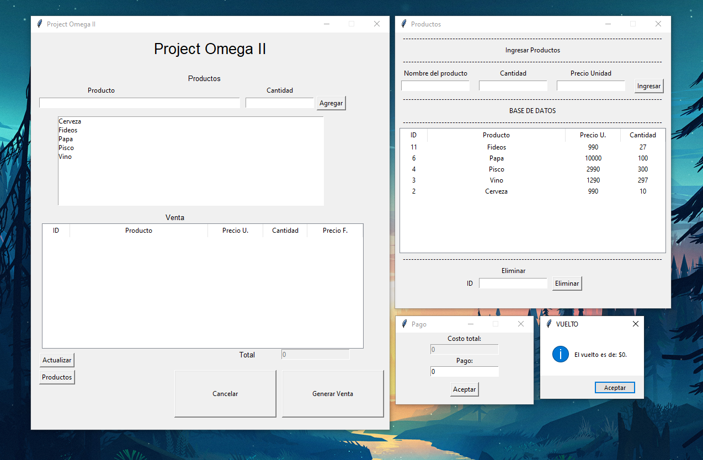
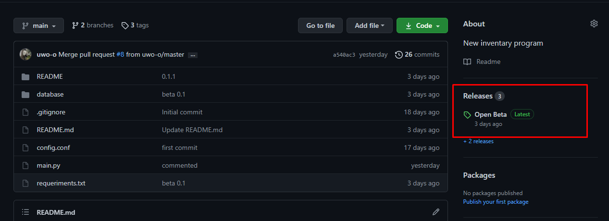
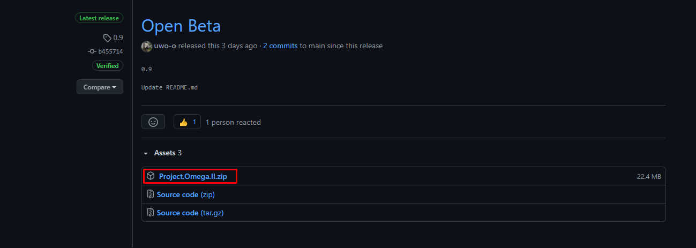

#Project-Omega-II
New inventary program

##HUGO CAMPOS - CHILE
                        
HI, THIS PROGRAM IS FOR FREE USEITS CONTINUE IN PROGRESS BUT IF YOU WANT YOU CAN USE IT OR DEBUG IT ORIGINALY THIS PROGRAM WAS THINKED TO USE IN A NEW BEER ENTERPRISE (LIKE A STARTUP, THAT IS THE PRINCIPAL REASON FOR THE PROGRAM IS SO BASIC) BUT CAN BE USED FOR ANYTHING TYPE OF INVENTARY.

^_^

THIS IS A NEW CONCEPT OF A OLD SAME PROGRAM

##THE PROGRAM LOOKS LIKE:



IT'S POSSIBLE IN AN FUTURE I UPGRADE THE INTERFACE AND USER EXPERIENCE

##HOW CAN I TRY THIS PROGRAM?


CLICK HERE:



AND THEN:



##HOW TO CREATE A EXECUTABLE PROGRAM

IN THE MAIN PATH USE

```pyinstaller --windowed --onefile main.py```

AND THEN DRAG THE "database" folder and "config.conf" file into "dist" folder

##THANKS FOR READ AND WATCH MY PROJECT
